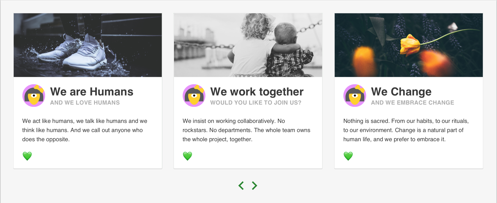

#  Mindera Card Slider Challenge

This challenge goal is to build a component which displays content using the Card design pattern, according to the specs included. This component should show a fixed (configurable) number of cards at a time, and slide for more when the user clicks the arrow buttons.

The component should look like the following mockup:

Additional specs available in [ui-specs.png](./ui-specs.png).

**Card behaviour:**

 - Clicking a card (anywhere) should open the corresponding link (card `href`);
 - A card heart should be filled if the card is liked and unfilled (outline only) if it is not;
 - Clicking a card's heart should like it.

**Assumptions:**

 - In order to get dummy data for display in your component, you can use the server provided in this repo;
 - If you find any missing spec on the design attached, use your best judgment to implement it;
 - Proceed the same way if you think there is any missing feature/implementation detail.

**Keep in mind:**

 - Bundle size and performance are important. Think twice before adding a dependency you might not need;
 - Unit tests are required;
 - The component(s) should be reusable on different parts of the project / different projects;
 - If transitions are used, make them as smooth as possible.

**Nice to have:**

 - Implement the component(s) responsively, in order to function properly and smoothly on mobile devices;
 - Try to keep the size of requests to the minimum;
 - Correctly handle the cases of small sets of data and large sets of data.

**We pay attention to:**

 - Code quality and consistency;
 - Naming conventions;
 - Styling;
 - Test quality;
 - Usability, accessibility and performance.

## Available Scripts

After installing dependencies with `yarn install`, you can run:

### `yarn start`

Runs the app in development mode.

Open [http://localhost:3000](http://localhost:3000) to view it in the browser.

The page will reload when you make edits.

### `yarn test`

Launches the test runner in interactive watch mode (uses Jest).

### `yarn start-api`

Launches the cards API on [http://localhost:3001/cards](http://localhost:3001/cards).

## Cards API

You can use `yarn start-api` to serve the data in `data/db.json` through a JSON REST API.

This launches [json-server](https://github.com/typicode/json-server). From its various features, you might find useful:

 - Slicing, to get a subset of items: `http://127.0.0.1:3001/cards?_start=8&_end=12`;
 - Support for all HTTP verbs, like `PATCH`, which might help you like/unlike cards.
